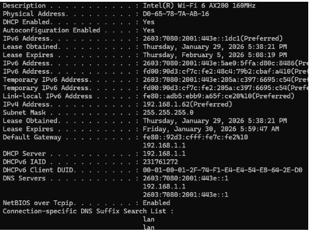
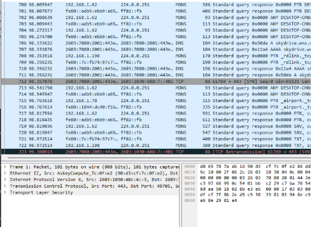
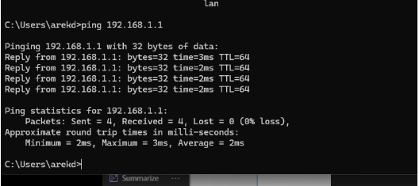
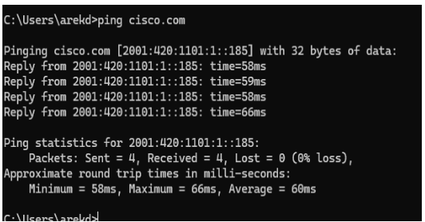
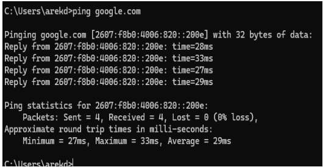
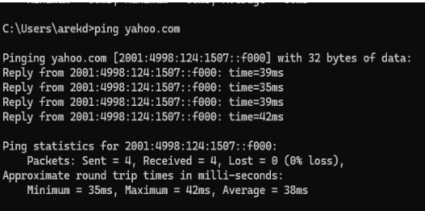

# Wireshark ICMP Traffic Analysis Lab

## Objective
Capture and analyze ICMP (ping) traffic in Wireshark to understand how connectivity testing works at the packet level.

## Tools Used
 Wireshark
 Windows Command Prompt
 Home network

## Commands Used
 ipconfig /all
 ping

## Steps Performed
1. Verified network configuration using `ipconfig /all`.
2. Opened Wireshark and selected the active network interface.
3. Started packet capture.
4. Generated ICMP traffic by running ping tests.
5. Filtered traffic using `icmp` and reviewed echo requests and replies.
6. Compared latency between local and remote hosts.

## Evidence

### Network Configuration (ipconfig)

### ICMP Capture in Wireshark

### Local Ping (Gateway)

### Cisco Ping Test

### Google Ping Test

### Yahoo Ping Test

## Result
Wireshark captured both echo requests and echo replies, confirming two-way ICMP communication. Remote hosts showed higher latency than the local gateway due to routing across multiple networks.
