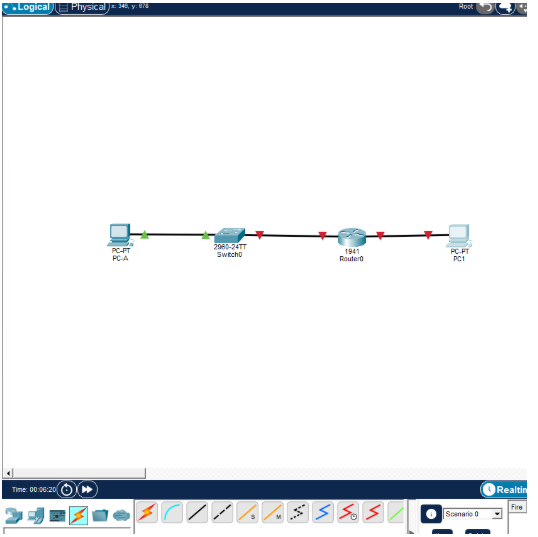
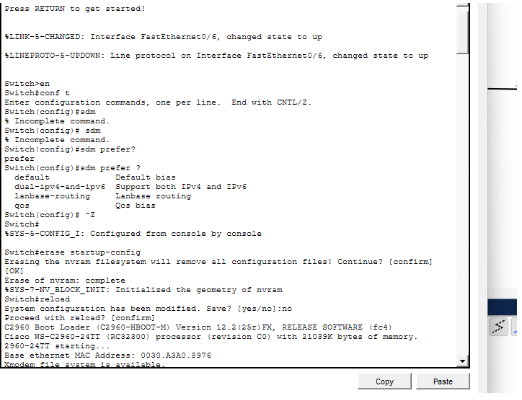
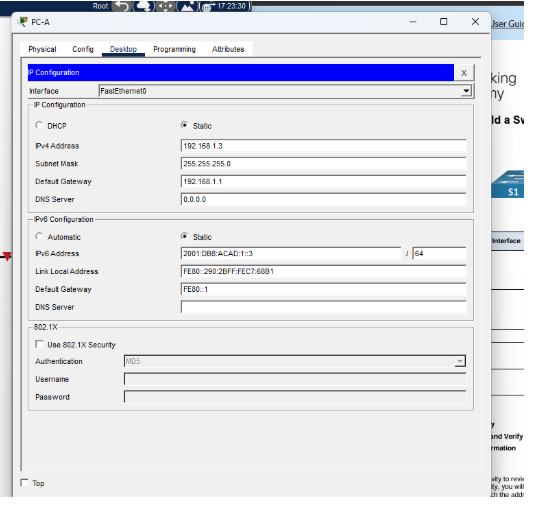
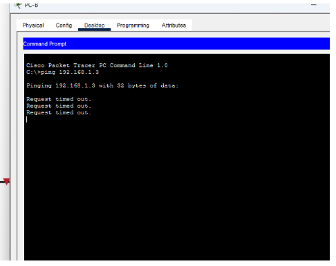
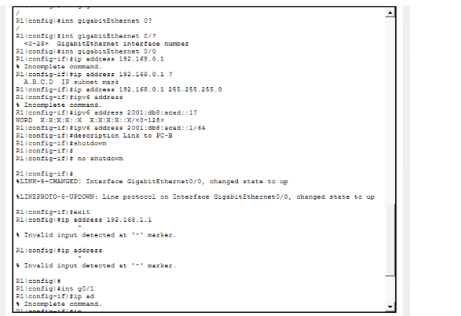
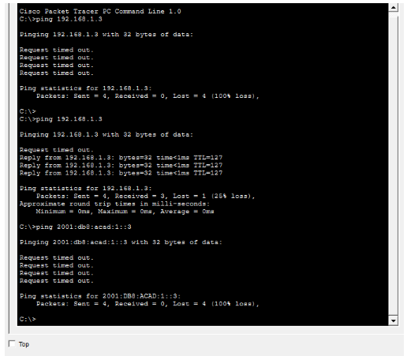
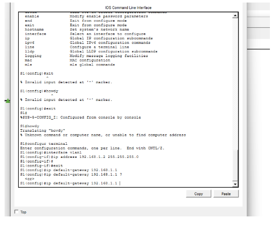
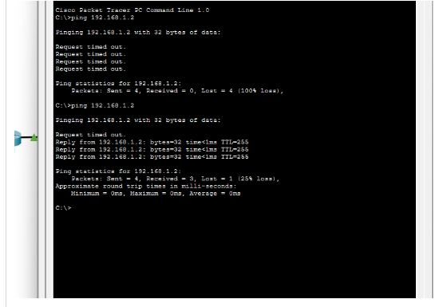
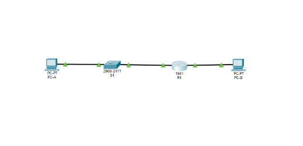

# Build a Switch and Router Network Lab

## Objective
This lab demonstrates how to build a small network using a router, a switch, and two PCs in Cisco Packet Tracer. The goal was to configure network devices, assign IP addresses, and verify connectivity between devices on different networks.

## Tools Used
- Cisco Packet Tracer
- Cisco IOS CLI
- Ping command for connectivity testing

---

## Initial Network Topology

The network was first built in Packet Tracer using two PCs, one switch, and one router.

---

## Resetting the Switch Configuration

The switch startup configuration was erased to ensure the device started with default settings.

---

## PC IP Address Configuration

Static IP addresses were assigned to the PCs so they could communicate within the network.

---

## Initial Connectivity Test

A ping test was performed before configuring the router. The test failed because the router had not yet been configured to route traffic between the networks.

---

## Router Configuration

The router interfaces were configured using Cisco IOS CLI commands and activated using the `no shutdown` command.

---

## Successful Connectivity Test

After router configuration, the ping test was repeated and communication between devices was successful.

---

## Switch Management Configuration

The switch management interface (VLAN 1) was configured with an IP address and default gateway.

---

## Switch Connectivity Test

A ping test was performed to verify connectivity to the switch management interface.

---

## Final Network Topology

The final network topology shows all devices properly connected and operational.

---

## Result

The router, switch, and PCs were successfully configured and tested. After enabling router interfaces and assigning IP addresses, devices were able to communicate across different networks. This lab demonstrates basic network configuration and connectivity verification using Cisco Packet Tracer.
